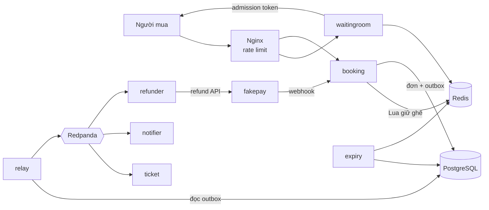

# TicketRush

Hệ thống bán vé sự kiện chịu tải cao, viết bằng Go.

Khi mở bán một concert, hàng chục nghìn người cùng bấm vào vài trăm ghế VIP trong vài giây. Hệ thống phải: không bao giờ bán một ghế cho hai người, giữ ghế có thời hạn trong lúc người mua thanh toán, xếp hàng người mua qua phòng chờ ảo, xử lý đúng webhook thanh toán bị trùng hoặc đến trễ, và vẫn đúng khi Redis, Kafka hay chính service chết giữa chừng.

Đặc tả đầy đủ: [SPEC.md](SPEC.md).

> **Trạng thái:** đang ở **M0 – khung dự án**. Chưa có API nghiệp vụ và chưa có số liệu đo.

## Demo

Chưa có (dự kiến sau M5).

## Kiến trúc



PostgreSQL là nguồn sự thật; Redis chỉ giữ trạng thái tạm và dựng lại được từ PostgreSQL. Chi tiết ở [SPEC.md mục 3](SPEC.md#3-kiến-trúc-tổng-thể).

## Kết quả đo

Chưa đo. Mọi số liệu sẽ được ghi ở [docs/results.md](docs/results.md) kèm cấu hình máy và commit hash.

## Quyết định kỹ thuật

Danh sách ADR ở [docs/adr/](docs/adr/README.md). Chưa có ADR nào; ADR đầu tiên (ADR-000, lý do làm bản gốc chỉ dùng PostgreSQL) thuộc M1.

## Chạy local

### Yêu cầu

- Go 1.27+
- Docker (trên macOS dùng OrbStack), Docker Compose v2
- `openssl`, `make`
- Từ M1: `sqlc`, `goose`; từ M1/M7: `k6`

### Khởi động

```sh
make up            # postgres, redis, redpanda, redpanda console; chờ đến khi healthy
make run-booking   # lần đầu tự tạo .env từ .env.example với secret ngẫu nhiên
curl -i localhost:8080/readyz
```

`/readyz` trả `200` khi kết nối được PostgreSQL và Redis, `503` nếu không (body chỉ ghi `ok`/`fail` cho từng phụ thuộc, lý do lỗi nằm trong log). `/healthz` luôn trả `200` khi process còn sống.

| Dịch vụ | Địa chỉ |
|---|---|
| Booking API | http://localhost:8080 |
| PostgreSQL | `localhost:5432` (user/pass/db: `ticketrush`) |
| Redis | `localhost:6379` |
| Redpanda (Kafka API) | `localhost:19092` |
| Redpanda Console | http://localhost:8088 |

Dừng hạ tầng bằng `make down` (volume dữ liệu được giữ lại). Xem mọi target bằng `make help`.

### Cấu hình

Mọi cấu hình qua biến môi trường, liệt kê trong [.env.example](.env.example). Service kiểm tra cấu hình khi khởi động và thoát kèm danh sách **tất cả** biến thiếu/sai trong một lần. Bốn secret (`JWT_SECRET`, `ADMISSION_SECRET`, `WEBHOOK_SECRET`, `TICKET_SECRET`) bắt buộc, dài tối thiểu 32 ký tự và phải khác nhau. File `.env` không được commit.

### Kiểm thử và lint

```sh
make test              # unit test, bật race detector
make test-integration  # test tích hợp (testcontainers, cần Docker) — chưa có test nào ở M0
make lint              # gofmt, go vet, staticcheck (phiên bản pin trong go.mod)
```

CI (GitHub Actions, [.github/workflows/ci.yaml](.github/workflows/ci.yaml)) chạy gofmt, `go vet`, staticcheck và `go test -race` trên mỗi push/PR.

Test tải (`make bench`) và chaos (`make chaos-*`) có từ M7/M8; hiện các target này báo "chưa triển khai" và trả exit code 1.

## Tiến độ

| Milestone | Nội dung | Trạng thái |
|---|---|---|
| M0 | Khung dự án, hạ tầng local, healthz/readyz, CI | Xong |
| M1 | Bản gốc chỉ dùng PostgreSQL | Chưa làm |
| M2 | Giữ ghế bằng Redis Lua | Chưa làm |
| M3 | Expiry worker và outbox | Chưa làm |
| M4 | Fakepay, webhook, saga | Chưa làm |
| M5 | Phòng chờ ảo, frontend | Chưa làm |
| M6 | Quan sát hệ thống | Chưa làm |
| M7 | Test tải, kiểm tra bất biến | Chưa làm |
| M8 | Chaos testing | Chưa làm |
| M9 | Kubernetes, CI hoàn chỉnh | Chưa làm |

## Hạn chế đã biết

- Mới có khung: booking chỉ phục vụ `/healthz` và `/readyz`.
- Cổng lắng nghe cố định theo SPEC (booking `:8080`), chưa cấu hình qua biến môi trường.
