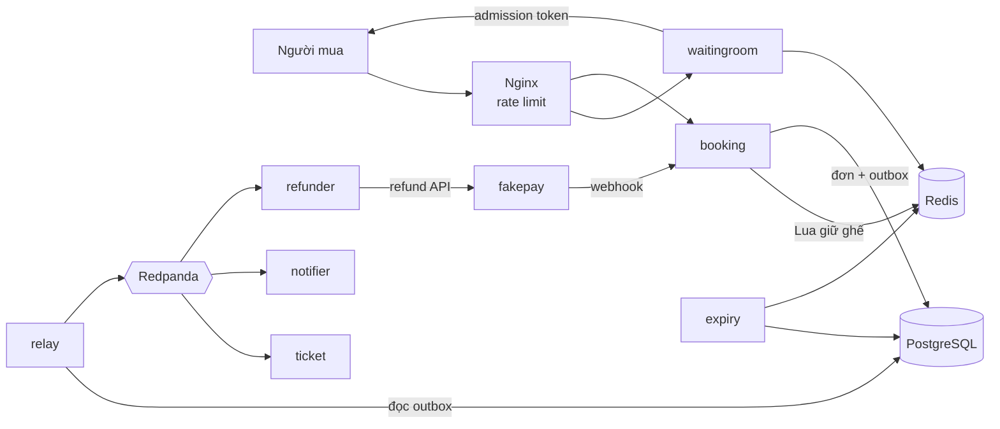

# TicketRush

Hệ thống bán vé sự kiện chịu tải cao, viết bằng Go.

Khi mở bán một concert, hàng chục nghìn người cùng bấm vào vài trăm ghế VIP trong vài giây. Hệ thống phải: không bao giờ bán một ghế cho hai người, giữ ghế có thời hạn trong lúc người mua thanh toán, xếp hàng người mua qua phòng chờ ảo, xử lý đúng webhook thanh toán bị trùng hoặc đến trễ, và vẫn đúng khi Redis, Kafka hay chính service chết giữa chừng.

Đặc tả đầy đủ: [SPEC.md](SPEC.md).

> **Trạng thái:** xong **M1 – bản gốc chỉ dùng PostgreSQL**, đang chờ review. Đã giữ ghế, tạo/xem/huỷ đơn với Idempotency-Key, có số liệu đo baseline. Chưa có Redis, thanh toán, phòng chờ.

## Demo

Chưa có (dự kiến sau M5).

## Kiến trúc



PostgreSQL là nguồn sự thật; Redis chỉ giữ trạng thái tạm và dựng lại được từ PostgreSQL. Chi tiết ở [SPEC.md mục 3](SPEC.md#3-kiến-trúc-tổng-thể).

## Kết quả đo

Baseline PostgreSQL, kịch bản mở bán 2.000 VU. Đo trên MacBook Apple M5 Pro 24 GiB, k6 chạy cùng máy, nên chỉ để so sánh tương đối. Chi tiết, cách tính và nhận xét ở [docs/results.md](docs/results.md#baseline-pg).

| Backend | Chế độ | Request giữ ghế | RPS đỉnh | p50 | p95 | p99 | Lỗi | Ghế bán trùng |
|---|---|---|---|---|---|---|---|---|
| pg | `BUYER_MODE=vu` (2 lần) | 3.728 / 3.901 | 888 / 765 | 3,1 / 3,0 ms | 35,4 / 17,0 ms | 175,2 / 35,5 ms | 0% | 0 |
| pg | `BUYER_MODE=iteration` | 14.825 | 2.209 | 348 ms | 790 ms | 839 ms | 0% | 0 |

Chưa đạt mục tiêu ≥ 5.000 req/s và p99 < 200 ms ở chế độ tải nặng. Bản Redis (M2) sẽ được đo trên cùng kịch bản.

## Quyết định kỹ thuật

Danh sách đầy đủ ở [docs/adr/](docs/adr/README.md).

- [ADR-000](docs/adr/000-ban-goc-postgresql.md): làm bản gốc giữ ghế chỉ bằng PostgreSQL (`SELECT … FOR UPDATE`) trước khi dùng Redis.
- [ADR-005](docs/adr/005-idempotency-key.md): Idempotency-Key: hash trên request đã chuẩn hoá, xử lý request song song cùng key.
- [ADR-006](docs/adr/006-lua-chon-khi-spec-chua-ro-m1.md): các lựa chọn khi SPEC chưa nói rõ ở M1.

## API (booking, `:8080`)

| Method | Đường dẫn | Ghi chú |
|---|---|---|
| POST | `/v1/auth/dev-login` | `{"user_id": 123}` → JWT 24 h. Chỉ bật khi `APP_ENV=dev` |
| GET | `/v1/events/{id}` | Thông tin sự kiện, các khu và giá |
| GET | `/v1/events/{id}/seats` | 5.000 ghế kèm trạng thái; cache 500 ms, gzip |
| POST | `/v1/orders` | Cần `Authorization` và `Idempotency-Key` (UUID). 201 tạo mới, 200 gửi lại |
| GET | `/v1/orders/{id}` | Chỉ chủ đơn xem được |
| POST | `/v1/orders/{id}/cancel` | Chỉ khi `HELD`; huỷ lại đơn đã huỷ vẫn trả 200 |
| GET | `/healthz`, `/readyz` | readyz kiểm tra PostgreSQL và Redis |

Lỗi luôn có dạng `{"error": {"code", "message", "details"}}`. Bảng mã lỗi ở [internal/httpx/errors.go](internal/httpx/errors.go).

## Chạy local

### Yêu cầu

- Go 1.27+
- Docker (trên macOS dùng OrbStack), Docker Compose v2
- `openssl`, `make`
- `sqlc` 1.31+, `goose` 3.x, `k6` (cài bằng `brew install sqlc goose k6`)

### Khởi động

```sh
make up            # postgres, redis, redpanda, redpanda console; chờ đến khi healthy
make migrate       # tạo schema
make seed          # sự kiện mẫu 5.000 ghế (sau make db-reset thì có id 1)
make run-booking   # lần đầu tự tạo .env từ .env.example với secret ngẫu nhiên
```

Thử một lượt mua:

```sh
TOKEN=$(curl -s -X POST localhost:8080/v1/auth/dev-login -d '{"user_id":123}' | jq -r .access_token)
curl -s -X POST localhost:8080/v1/orders \
  -H "Authorization: Bearer $TOKEN" -H "Idempotency-Key: $(uuidgen)" \
  -d '{"event_id":1,"seat_ids":["VIP-A-12","VIP-A-13"]}'
```

`/readyz` trả `200` khi kết nối được PostgreSQL và Redis, `503` nếu không (body chỉ ghi `ok`/`fail` cho từng phụ thuộc, lý do lỗi nằm trong log). `/healthz` luôn trả `200` khi process còn sống.

| Dịch vụ | Địa chỉ |
|---|---|
| Booking API | http://localhost:8080 |
| PostgreSQL | `localhost:5432` (user/pass/db: `ticketrush`) |
| Redis | `localhost:6379` |
| Redpanda (Kafka API) | `localhost:19092` |
| Redpanda Console | http://localhost:8088 |

Dừng hạ tầng bằng `make down` (volume dữ liệu được giữ lại). Xem mọi target bằng `make help`.

### Cấu hình

Mọi cấu hình qua biến môi trường, liệt kê trong [.env.example](.env.example). Service kiểm tra cấu hình khi khởi động và thoát kèm danh sách **tất cả** biến thiếu/sai trong một lần. Bốn secret (`JWT_SECRET`, `ADMISSION_SECRET`, `WEBHOOK_SECRET`, `TICKET_SECRET`) bắt buộc, dài tối thiểu 32 ký tự và phải khác nhau. File `.env` không được commit.

### Kiểm thử và lint

```sh
make test              # unit test, bật race detector
make test-integration  # test tích hợp với PostgreSQL thật (testcontainers, cần Docker)
make lint              # gofmt, go vet, staticcheck, sqlc diff
```

Test tích hợp chạy mỗi test trên một database riêng, clone từ template đã migrate. Trong đó có:
- 1.000 goroutine cùng giữ `VIP-A-1` thì đúng 1 thành công;
- 200 goroutine giữ ngẫu nhiên 2 ghế trong 20 ghế thì không ghế nào thuộc hai đơn;
- 10 request song song cùng Idempotency-Key thì chỉ ra 1 đơn;
- luồng HTTP đầu–cuối.

CI (GitHub Actions, [.github/workflows/ci.yaml](.github/workflows/ci.yaml)) có hai job:
- lint + unit test: gofmt, `sqlc diff`, `go vet`, staticcheck, `go test -race`;
- test tích hợp.

### Test tải

```sh
make db-reset seed     # dữ liệu sạch, sự kiện id 1
make run-booking       # terminal khác
make load-hold         # k6 kịch bản mở bán + tính RPS đỉnh; kết quả vào loadtest/out/
BUYER_MODE=iteration make load-hold   # biến thể mỗi vòng lặp là một người mua mới
```

`make bench` và chaos (`make chaos-*`) có từ M7/M8; hiện các target này báo "chưa triển khai" và trả exit code 1.

## Tiến độ

| Milestone | Nội dung | Trạng thái |
|---|---|---|
| M0 | Khung dự án, hạ tầng local, healthz/readyz, CI | Xong |
| M1 | Bản gốc chỉ dùng PostgreSQL | Xong, chờ review |
| M2 | Giữ ghế bằng Redis Lua | Chưa làm |
| M3 | Expiry worker và outbox | Chưa làm |
| M4 | Fakepay, webhook, saga | Chưa làm |
| M5 | Phòng chờ ảo, frontend | Chưa làm |
| M6 | Quan sát hệ thống | Chưa làm |
| M7 | Test tải, kiểm tra bất biến | Chưa làm |
| M8 | Chaos testing | Chưa làm |
| M9 | Kubernetes, CI hoàn chỉnh | Chưa làm |

## Hạn chế đã biết

- Chỉ có backend giữ ghế PostgreSQL. Booking từ chối chạy với `INVENTORY_BACKEND=redis` (M2) hoặc `REQUIRE_ADMISSION=true` (M5).
- Chưa có expiry worker (M3): đơn `HELD` quá hạn vẫn ở trạng thái `HELD` (dù ghế đã được giải phóng khi `seat_holds` hết hạn), nên người đó chưa tạo được đơn mới cho sự kiện cho đến khi tự huỷ đơn cũ.
- Outbox đã được ghi nhưng chưa có relay đẩy lên Kafka (M3).
- Chưa có thanh toán, nên response chưa có `payment_url` (M4).
- Sự kiện và ghế được cache trong process suốt vòng đời của nó; seed lại với sơ đồ khác thì phải khởi động lại booking.
- Cổng lắng nghe cố định theo SPEC (booking `:8080`), chưa cấu hình qua biến môi trường.
