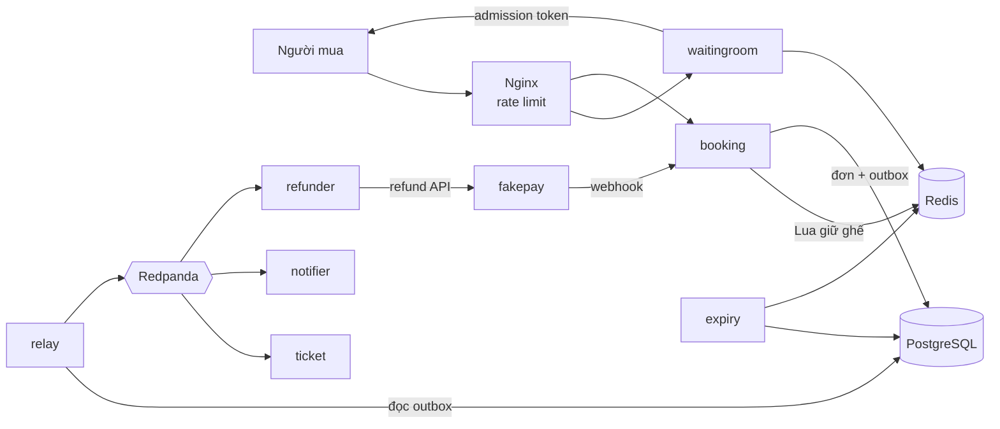
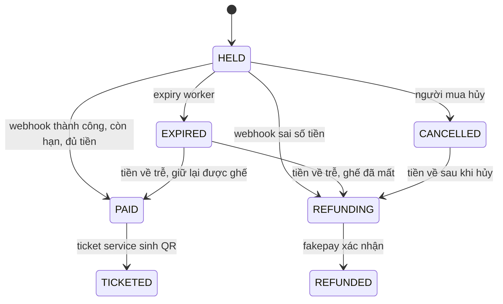

# TicketRush — Đặc tả kỹ thuật

> Hệ thống bán vé sự kiện chịu tải cao: không bán trùng ghế, giữ ghế có thời hạn, phòng chờ ảo, thanh toán qua cổng giả lập, xuất vé QR, và vẫn đúng khi một thành phần chết giữa chừng.
>
> Tài liệu này là nguồn sự thật cho việc triển khai. Làm theo từng milestone ở mục 12, mỗi milestone có tiêu chí hoàn thành rõ ràng.

---

## Mục lục

1. Mục tiêu và phạm vi
2. Stack công nghệ
3. Kiến trúc tổng thể
4. Cấu trúc repo
5. Cơ sở dữ liệu
6. Redis: key và script
7. API
8. Máy trạng thái đơn hàng
9. Các luồng xử lý chi tiết
10. Kafka: topic và sự kiện
11. Cấu hình
12. Milestones
13. Kiểm thử
14. Quan sát hệ thống
15. Tài liệu cần viết

---

## 1. Mục tiêu và phạm vi

### 1.1 Mục tiêu đo được

| Chỉ số | Mục tiêu |
|---|---|
| Ghế bán trùng | **0**, trong mọi kịch bản, kể cả chaos test |
| Throughput API giữ ghế | ≥ 5.000 request/giây ở đỉnh (đo trên VPS, ghi rõ cấu hình) |
| Độ trễ p99 API giữ ghế | < 200 ms |
| Thời hạn giữ ghế | 10 phút (cấu hình được) |
| Thời gian phục hồi khi Redis restart | Đo và ghi lại, mục tiêu < 30 giây |

Đây là **mục tiêu**. Kết quả thật được ghi vào `docs/results.md`. **Không bao giờ bịa số liệu.**

### 1.2 Trong phạm vi

- Sự kiện có sơ đồ ghế đánh số (mỗi ghế một giá theo khu).
- Phòng chờ ảo trước giờ mở bán và trong lúc bán.
- Giữ tối đa 4 ghế mỗi đơn, mỗi người tối đa 1 đơn đang giữ cho mỗi sự kiện.
- Thanh toán qua cổng giả lập (service riêng), webhook có chữ ký HMAC.
- Xuất vé có mã QR ký HMAC.
- Hoàn tiền tự động khi tiền về nhưng không thể xuất vé.
- Thông báo qua log hoặc Telegram bot (tùy chọn).
- Giao diện web tối giản: vào hàng chờ, chọn ghế, thanh toán, xem vé.

### 1.3 Ngoài phạm vi

- Đăng ký/đăng nhập thật (dùng endpoint dev-login cấp JWT).
- Trang quản trị (tạo sự kiện bằng lệnh seed).
- Cổng thanh toán thật.
- Đa tiền tệ, thuế, mã giảm giá.

---

## 2. Stack công nghệ

| Hạng mục | Lựa chọn | Ghi chú |
|---|---|---|
| Ngôn ngữ | Go (bản stable mới nhất, tối thiểu 1.23) | |
| HTTP router | `github.com/go-chi/chi/v5` | |
| PostgreSQL driver | `github.com/jackc/pgx/v5` (dùng `pgxpool`) | |
| Sinh code truy vấn | `sqlc` | Query viết tay trong `internal/*/queries.sql` |
| Migration | `github.com/pressly/goose/v3` | |
| Redis client | `github.com/redis/go-redis/v9` | |
| Kafka client | `github.com/twmb/franz-go` | |
| Kafka local | Redpanda (tương thích Kafka API) | `--smp 1 --memory 1G` |
| JWT | `github.com/golang-jwt/jwt/v5` | HS256 |
| QR | `github.com/skip2/go-qrcode` | |
| Log | `log/slog` (JSON) | |
| Tracing/metrics | OpenTelemetry Go SDK, Prometheus client | |
| Test tích hợp | `github.com/testcontainers/testcontainers-go` | |
| Test tải | k6 | `brew install k6` |
| Chaos | Toxiproxy (container) + script shell | |
| Container | Docker Compose (chạy bằng OrbStack trên macOS) | |
| Kubernetes | k3d (chỉ milestone cuối) | |
| CI | GitHub Actions | |
| Frontend | HTML + JS thuần, serve tĩnh từ Booking Service | Không dùng framework |

Kiểm tra phiên bản mới nhất của từng thư viện khi cài, pin phiên bản trong `go.mod`.

---

## 3. Kiến trúc tổng thể



### 3.1 Nguyên tắc

1. **PostgreSQL là nguồn sự thật.** Redis chỉ giữ trạng thái tạm, có thể dựng lại từ PostgreSQL.
2. **Hai lớp chống bán trùng:** Redis Lua chặn nhanh; `UNIQUE (event_id, seat_id)` trên bảng `tickets` chặn cuối.
3. **Mọi handler nhận sự kiện từ ngoài đều idempotent:** API tạo đơn (Idempotency-Key), webhook (provider_txn_id), consumer Kafka (kiểm tra trạng thái trước khi làm).
4. **Không gửi Kafka trực tiếp từ handler.** Luôn ghi vào bảng `outbox` trong cùng transaction.
5. **Modular monolith trước.** Các binary trong `cmd/` dùng chung code trong `internal/`. Chỉ tách deploy riêng khi có lý do đo được.
6. **Tiền là `BIGINT` đơn vị đồng.** Không dùng số thực.
7. **Thời gian lấy từ PostgreSQL `now()`** cho mọi quyết định hết hạn, để tránh lệch đồng hồ giữa các service.

### 3.2 Các binary

| Binary | Nhiệm vụ |
|---|---|
| `cmd/booking` | API công khai: dev-login, sơ đồ ghế, tạo/hủy/xem đơn, nhận webhook, xem vé. Serve frontend tĩnh. |
| `cmd/waitingroom` | API hàng chờ: vào hàng, SSE báo vị trí. Chạy worker cấp token trong cùng process. |
| `cmd/relay` | Đọc `outbox`, publish lên Kafka. |
| `cmd/expiry` | Chuyển đơn hết hạn sang `EXPIRED`, nhả ghế. |
| `cmd/ticket` | Consumer `order.paid`: sinh QR, chuyển đơn sang `TICKETED`. |
| `cmd/refunder` | Consumer `order.refund_requested`: gọi fakepay hoàn tiền. |
| `cmd/notifier` | Consumer: log hoặc gửi Telegram khi vé được xuất / hoàn tiền. |
| `cmd/fakepay` | Cổng thanh toán giả lập, có chế độ gây lỗi cấu hình được. |
| `cmd/seed` | Tạo sự kiện mẫu và sơ đồ ghế. |
| `cmd/reconcile` | Dựng lại trạng thái Redis từ PostgreSQL. |
| `tools/invariants` | Kiểm tra bất biến sau test. |

---

## 4. Cấu trúc repo

```
ticketrush/
├── CLAUDE.md
├── SPEC.md
├── Makefile
├── go.mod
├── cmd/
│   ├── booking/
│   ├── waitingroom/
│   ├── relay/
│   ├── expiry/
│   ├── ticket/
│   ├── refunder/
│   ├── notifier/
│   ├── fakepay/
│   ├── seed/
│   └── reconcile/
├── internal/
│   ├── auth/            # JWT người dùng + admission token
│   ├── inventory/       # interface Inventory, impl pg và redis, file .lua
│   ├── order/           # máy trạng thái, service tạo đơn, xử lý webhook
│   ├── payment/         # client fakepay, xác thực chữ ký webhook
│   ├── queue/           # logic phòng chờ
│   ├── outbox/          # ghi và relay outbox
│   ├── ticket/          # sinh và xác thực QR
│   ├── events/          # định nghĩa payload sự kiện Kafka
│   ├── httpx/           # middleware, lỗi chuẩn, idempotency
│   └── platform/        # config, db pool, redis, kafka, otel, slog
├── migrations/
├── web/                 # index.html, app.js, style.css
├── loadtest/            # kịch bản k6
├── chaos/               # script chaos
├── tools/invariants/
├── deploy/
│   ├── compose.yaml
│   ├── nginx.conf
│   ├── prometheus.yml
│   ├── grafana/
│   └── k8s/
├── docs/
│   ├── adr/
│   ├── results.md
│   └── debug-journal.md
└── .github/workflows/ci.yaml
```

---

## 5. Cơ sở dữ liệu

File migration đầu tiên: `migrations/00001_init.sql` (định dạng goose).

```sql
-- +goose Up
CREATE TABLE users (
  id          BIGINT PRIMARY KEY,
  created_at  TIMESTAMPTZ NOT NULL DEFAULT now()
);

CREATE TABLE events (
  id             BIGSERIAL PRIMARY KEY,
  name           TEXT NOT NULL,
  venue          TEXT NOT NULL,
  starts_at      TIMESTAMPTZ NOT NULL,
  sale_opens_at  TIMESTAMPTZ NOT NULL,
  max_seats_per_order INT NOT NULL DEFAULT 4
);

CREATE TABLE seats (
  event_id   BIGINT NOT NULL REFERENCES events(id),
  seat_id    TEXT   NOT NULL,          -- 'VIP-A-12'
  zone       TEXT   NOT NULL,          -- 'VIP', 'CAT1', 'CAT2', 'GA'
  row_label  TEXT   NOT NULL,
  seat_no    INT    NOT NULL,
  price_vnd  BIGINT NOT NULL CHECK (price_vnd > 0),
  PRIMARY KEY (event_id, seat_id)
);

CREATE TABLE orders (
  id                UUID PRIMARY KEY,
  event_id          BIGINT NOT NULL REFERENCES events(id),
  user_id           BIGINT NOT NULL,
  status            TEXT   NOT NULL CHECK (status IN
                      ('HELD','PAID','TICKETED','EXPIRED','CANCELLED','REFUNDING','REFUNDED')),
  total_vnd         BIGINT NOT NULL,
  idempotency_key   TEXT   NOT NULL,
  request_hash      TEXT   NOT NULL,   -- sha256 của body, để phát hiện dùng lại key với body khác
  hold_expires_at   TIMESTAMPTZ NOT NULL,
  created_at        TIMESTAMPTZ NOT NULL DEFAULT now(),
  updated_at        TIMESTAMPTZ NOT NULL DEFAULT now(),
  UNIQUE (user_id, idempotency_key)
);

-- Mỗi người chỉ có 1 đơn đang giữ cho mỗi sự kiện
CREATE UNIQUE INDEX orders_one_held_per_user
  ON orders (event_id, user_id) WHERE status = 'HELD';

CREATE INDEX orders_held_expiry ON orders (hold_expires_at) WHERE status = 'HELD';

CREATE TABLE order_seats (
  order_id  UUID   NOT NULL REFERENCES orders(id),
  event_id  BIGINT NOT NULL,
  seat_id   TEXT   NOT NULL,
  price_vnd BIGINT NOT NULL,
  PRIMARY KEY (order_id, seat_id),
  FOREIGN KEY (event_id, seat_id) REFERENCES seats(event_id, seat_id)
);

-- Lớp chặn cuối cùng: một ghế chỉ có một vé
CREATE TABLE tickets (
  id         UUID   PRIMARY KEY,
  order_id   UUID   NOT NULL REFERENCES orders(id),
  event_id   BIGINT NOT NULL,
  seat_id    TEXT   NOT NULL,
  qr_payload TEXT,                     -- điền bởi ticket service
  issued_at  TIMESTAMPTZ,
  UNIQUE (event_id, seat_id)
);

CREATE TABLE payments (
  provider_txn_id TEXT PRIMARY KEY,    -- chống xử lý webhook trùng
  order_id        UUID   NOT NULL REFERENCES orders(id),
  amount_vnd      BIGINT NOT NULL,
  status          TEXT   NOT NULL CHECK (status IN ('SUCCEEDED','FAILED')),
  outcome         TEXT   NOT NULL,     -- 'APPLIED' | 'REFUND_REQUIRED' | 'IGNORED_FAILED'
  received_at     TIMESTAMPTZ NOT NULL DEFAULT now()
);

CREATE TABLE refunds (
  provider_txn_id TEXT PRIMARY KEY REFERENCES payments(provider_txn_id),  -- 1 giao dịch hoàn tối đa 1 lần
  order_id        UUID   NOT NULL REFERENCES orders(id),
  amount_vnd      BIGINT NOT NULL,
  reason          TEXT   NOT NULL,     -- 'LATE_PAYMENT_SEAT_TAKEN', 'AMOUNT_MISMATCH', ...
  status          TEXT   NOT NULL CHECK (status IN ('PENDING','SUCCEEDED')),
  created_at      TIMESTAMPTZ NOT NULL DEFAULT now(),
  completed_at    TIMESTAMPTZ
);

CREATE TABLE outbox (
  id            BIGSERIAL PRIMARY KEY,
  topic         TEXT  NOT NULL,
  msg_key       TEXT  NOT NULL,        -- order_id, để giữ thứ tự theo đơn
  event_type    TEXT  NOT NULL,
  payload       JSONB NOT NULL,
  created_at    TIMESTAMPTZ NOT NULL DEFAULT now(),
  published_at  TIMESTAMPTZ
);
CREATE INDEX outbox_unpublished ON outbox (id) WHERE published_at IS NULL;

-- Chỉ dùng cho backend inventory = pg (bản gốc để so sánh)
CREATE TABLE seat_holds (
  event_id   BIGINT NOT NULL,
  seat_id    TEXT   NOT NULL,
  order_id   UUID   NOT NULL,
  expires_at TIMESTAMPTZ NOT NULL,
  PRIMARY KEY (event_id, seat_id)
);

-- +goose Down
DROP TABLE seat_holds, outbox, refunds, payments, tickets, order_seats, orders, seats, events, users;
```

**Lưu ý:** hàng trong `tickets` được tạo ngay trong transaction xử lý webhook thanh toán thành công (để ràng buộc UNIQUE có tác dụng đúng lúc). Ticket service chỉ điền `qr_payload` và `issued_at` sau đó.

---

## 6. Redis: key và script

### 6.1 Key

| Key | Kiểu | Giá trị | TTL |
|---|---|---|---|
| `seat:{<eventId>}:<seatId>` | string | `held:<orderId>` hoặc `sold:<orderId>` | held: `HOLD_TTL + HOLD_GRACE`; sold: không |
| `queue:{<eventId>}` | sorted set | member = queueId, score = thời điểm vào (ms) | |
| `queue:{<eventId>}:user:<userId>` | string | queueId (chống vào hàng 2 lần) | 2 giờ |
| `admitted:<queueId>` | string | admission token (JWT) | `ADMISSION_TTL` |
| `admission:used:<jti>` | string | orderId | `ADMISSION_TTL` |
| `seatmap:{<eventId>}:version` | string | số tăng dần mỗi lần ghế đổi trạng thái | |

Dấu `{eventId}` là **hash tag**: đảm bảo mọi key của một sự kiện nằm cùng slot khi chạy Redis Cluster, nếu không script nhiều key sẽ lỗi `CROSSSLOT`.

Ghế **không có key** nghĩa là **còn trống**. Không cần seed Redis.

### 6.2 Vì sao có `HOLD_GRACE`

TTL trong Redis = `HOLD_TTL + HOLD_GRACE` (mặc định 10 phút + 30 giây), còn PostgreSQL chỉ chấp nhận thanh toán khi `now() <= hold_expires_at` (10 phút). Nhờ 30 giây dư, không ai giữ được ghế đó trong Redis trước khi PostgreSQL chắc chắn đã coi đơn cũ là hết hạn. Việc này chặn trường hợp lệch đồng hồ giữa Redis và PostgreSQL.

### 6.3 Script `hold.lua`

```lua
-- KEYS: seat keys của cùng một event
-- ARGV[1] = orderId, ARGV[2] = ttl_ms
-- Trả về: {1} nếu giữ được tất cả; {0, key1, key2...} danh sách ghế bị chiếm
local taken = {}
for _, k in ipairs(KEYS) do
  local v = redis.call('GET', k)
  if v and v ~= ('held:' .. ARGV[1]) then
    table.insert(taken, k)
  end
end
if #taken > 0 then
  local res = {0}
  for _, k in ipairs(taken) do table.insert(res, k) end
  return res
end
for _, k in ipairs(KEYS) do
  redis.call('SET', k, 'held:' .. ARGV[1], 'PX', ARGV[2])
end
return {1}
```

Script này idempotent: gọi lại với cùng orderId thì vẫn thành công.

### 6.4 Script `release.lua`

```lua
-- Chỉ xóa key nếu đang do đúng orderId giữ
-- ARGV[1] = orderId
local n = 0
for _, k in ipairs(KEYS) do
  if redis.call('GET', k) == ('held:' .. ARGV[1]) then
    redis.call('DEL', k)
    n = n + 1
  end
end
return n
```

### 6.5 Script `confirm.lua`

```lua
-- Chuyển ghế sang sold vĩnh viễn. Gọi SAU khi PostgreSQL đã commit vé.
-- ARGV[1] = orderId
for _, k in ipairs(KEYS) do
  local v = redis.call('GET', k)
  if v == false or v == ('held:' .. ARGV[1]) or v == ('sold:' .. ARGV[1]) then
    redis.call('SET', k, 'sold:' .. ARGV[1])
  else
    -- Không thể xảy ra nếu hệ thống đúng; trả lỗi để log cảnh báo
    return {0, k, v}
  end
end
return {1}
```

Nạp script bằng `redis.NewScript(...)` của go-redis (tự dùng `EVALSHA`, fallback `EVAL`). File `.lua` nằm trong `internal/inventory/lua/`, nhúng bằng `//go:embed`.

---

## 7. API

Mọi response lỗi dùng chung dạng:

```json
{ "error": { "code": "SEATS_UNAVAILABLE", "message": "Một số ghế đã có người giữ", "details": { ... } } }
```

Mọi request có header `X-Request-Id` (sinh nếu thiếu), trả lại trong response và ghi vào log/trace.

### 7.1 Booking Service (`:8080`)

#### `POST /v1/auth/dev-login`
Body `{ "user_id": 123 }` → `200 { "access_token": "<jwt>", "expires_in": 86400 }`.
Tạo user nếu chưa có. **Chỉ bật khi `APP_ENV=dev`**.

#### `GET /v1/events/{eventId}`
Thông tin sự kiện + danh sách khu và giá.

#### `GET /v1/events/{eventId}/seats`
```json
{
  "version": 1842,
  "seats": [
    { "seat_id": "VIP-A-1", "zone": "VIP", "row": "A", "no": 1, "price_vnd": 3500000, "status": "AVAILABLE" }
  ]
}
```
`status` ∈ `AVAILABLE | HELD | SOLD`. Lấy danh sách ghế từ PostgreSQL (cache trong process, ghế không đổi), trạng thái bằng `MGET` các seat key theo lô 500. Cache toàn bộ response trong process 500 ms để giảm tải khi hàng nghìn người cùng xem.

#### `POST /v1/orders`
Header bắt buộc:
- `Authorization: Bearer <user access token>`
- `X-Admission-Token: <admission token>`
- `Idempotency-Key: <uuid do client sinh>`

Body:
```json
{ "event_id": 1, "seat_ids": ["VIP-A-12", "VIP-A-13"] }
```

Response:
- `201` đơn mới:
  ```json
  { "order_id": "…", "status": "HELD", "total_vnd": 7000000,
    "hold_expires_at": "2026-10-01T20:10:00Z", "payment_url": "http://localhost:8090/pay/…" }
  ```
- `200` cùng body nếu Idempotency-Key đã dùng với **cùng** body (trả lại đơn cũ).
- `401 UNAUTHORIZED` thiếu/sai token người dùng.
- `403 ADMISSION_REQUIRED` thiếu/sai/hết hạn admission token, hoặc token thuộc sự kiện khác.
- `403 ADMISSION_ALREADY_USED` token đã tạo đơn khác.
- `409 SEATS_UNAVAILABLE` `details.seat_ids` là các ghế bị chiếm.
- `409 ACTIVE_ORDER_EXISTS` người dùng đã có đơn HELD cho sự kiện này.
- `422 IDEMPOTENCY_KEY_REUSED` cùng key nhưng body khác.
- `422 VALIDATION_ERROR` quá số ghế, ghế không tồn tại, trùng ghế trong danh sách, chưa đến giờ mở bán.

#### `GET /v1/orders/{orderId}`
Chỉ chủ đơn xem được. Trả trạng thái, ghế, tổng tiền, hạn giữ, và vé nếu đã xuất.

#### `POST /v1/orders/{orderId}/cancel`
Chỉ khi `HELD`. Chuyển sang `CANCELLED`, nhả ghế. Idempotent: hủy đơn đã hủy trả `200`.

#### `POST /v1/webhooks/fakepay`
Header `X-Signature: hex(hmac_sha256(WEBHOOK_SECRET, raw_body))`.
```json
{ "provider_txn_id": "fp_…", "order_id": "…", "amount_vnd": 7000000, "status": "SUCCEEDED", "paid_at": "…" }
```
Luôn trả `200` nếu chữ ký đúng và đã ghi nhận (kể cả webhook trùng, kể cả khi phải hoàn tiền). Trả `401` nếu sai chữ ký. Trả `500` chỉ khi lỗi hạ tầng (để fakepay gửi lại).

#### `GET /v1/orders/{orderId}/tickets`
Danh sách vé kèm ảnh QR dạng PNG base64.

#### `GET /healthz`, `GET /readyz`, `GET /metrics`
`readyz` trả `503` khi chưa kết nối được PostgreSQL/Redis, hoặc khi đang reconcile.

### 7.2 Waiting Room (`:8081`)

#### `POST /v1/queue/{eventId}/join`
Header `Authorization: Bearer <user access token>`.
`200 { "queue_id": "…", "position": 1532 }`. Gọi lại khi đã trong hàng trả đúng queue_id cũ.

#### `GET /v1/queue/{eventId}/stream?queue_id=…`
Server-Sent Events. Server gửi mỗi 2 giây:
```
event: position
data: {"position": 1204, "estimated_wait_seconds": 60}

event: admitted
data: {"admission_token": "<jwt>", "expires_in": 300}
```
Đóng stream sau khi gửi `admitted`. Hỗ trợ reconnect: nếu `admitted:<queueId>` đã có thì gửi ngay.

#### Admission token
JWT HS256, secret riêng (`ADMISSION_SECRET`), claims:
```json
{ "sub": "<userId>", "eid": <eventId>, "qid": "<queueId>", "jti": "<uuid>", "exp": … }
```

#### Worker cấp token
Chạy trong process waitingroom, mỗi `ADMIT_INTERVAL` (1 giây): `ZPOPMIN queue:{eid} ADMIT_BATCH`, sinh token, `SET admitted:<qid> <token> EX ADMISSION_TTL`. Chỉ một instance được cấp token cùng lúc: dùng khóa Redis `SET admit:lock:{eid} <instanceId> NX PX 3000`, gia hạn mỗi vòng.

`ADMIT_BATCH` là tham số tinh chỉnh. Giá trị ban đầu tính từ throughput đo được của Booking Service; ghi cách tính vào ADR.

### 7.3 Fakepay (`:8090`)

#### `POST /v1/payments`
Booking gọi khi tạo đơn: `{ "order_id", "amount_vnd", "callback_url" }` → `{ "payment_url" }`.

#### `GET /pay/{orderId}`
Trang HTML đơn giản có nút "Thanh toán thành công" và "Thanh toán thất bại".

#### `POST /pay/{orderId}/complete`
Body `{ "result": "SUCCEEDED" | "FAILED" }`. Sinh `provider_txn_id`, gửi webhook về `callback_url` theo cấu hình gây lỗi:

| Biến môi trường | Ý nghĩa | Mặc định |
|---|---|---|
| `FAKEPAY_DELAY_MS_MIN` / `MAX` | Độ trễ ngẫu nhiên trước khi gửi webhook | 100 / 2000 |
| `FAKEPAY_DUPLICATE_RATE` | Xác suất gửi thêm 1–3 bản trùng | 0.2 |
| `FAKEPAY_LATE_RATE` | Xác suất trễ thêm `FAKEPAY_LATE_EXTRA_MS` | 0.05 |
| `FAKEPAY_LATE_EXTRA_MS` | | 660000 (11 phút) |
| `FAKEPAY_5XX_RATE` | Xác suất fakepay tự coi lần gửi là lỗi và gửi lại | 0.1 |

Gửi lại với backoff lũy thừa (1s, 2s, 4s… tối đa 8 lần) đến khi nhận `200`.

#### `POST /v1/payments/auto`
Chế độ cho k6: tạo và hoàn tất thanh toán ngay trong một call, không cần trang HTML.

#### `POST /v1/refunds`
`{ "order_id", "provider_txn_id", "amount_vnd" }` → `200`. Idempotent theo `provider_txn_id`.

---

## 8. Máy trạng thái đơn hàng



Quy tắc triển khai:
- Toàn bộ bảng chuyển trạng thái nằm trong `internal/order/state.go` dưới dạng map `from → []to`. Hàm `CanTransition(from, to)` được unit test cho **mọi** cặp.
- Mọi câu UPDATE trạng thái có điều kiện: `UPDATE orders SET status=$new, updated_at=now() WHERE id=$id AND status=$expected`. Nếu 0 dòng bị ảnh hưởng → đọc lại và xử lý theo trạng thái hiện tại, không ghi đè.
- Mỗi lần chuyển trạng thái ghi một dòng outbox trong cùng transaction.

---

## 9. Các luồng xử lý chi tiết

### 9.1 Tạo đơn (`POST /v1/orders`), backend Redis

1. Xác thực user JWT và admission token (đúng `eid`, `sub` khớp user, chưa hết hạn).
2. Validate body: 1 ≤ số ghế ≤ `max_seats_per_order`, không trùng, tất cả ghế tồn tại (từ cache), đã qua `sale_opens_at`.
3. Tính `request_hash = sha256(canonical_json(body))`.
4. Tìm đơn theo `(user_id, idempotency_key)`:
   - Có và hash khớp → trả `200` với đơn đó.
   - Có và hash khác → `422 IDEMPOTENCY_KEY_REUSED`.
5. `SET admission:used:<jti> <newOrderId> NX EX ADMISSION_TTL`. Nếu thất bại và giá trị khác orderId đang tạo → `403 ADMISSION_ALREADY_USED`.
6. Sinh `orderId` (UUIDv7). Chạy `hold.lua` với `ttl = HOLD_TTL + HOLD_GRACE`.
   - Thất bại → xóa `admission:used:<jti>` (để người dùng thử ghế khác), trả `409 SEATS_UNAVAILABLE`.
7. Transaction PostgreSQL:
   - `INSERT orders (..., status='HELD', hold_expires_at = now() + HOLD_TTL)`
   - `INSERT order_seats`
   - `INSERT outbox (order.held)`
8. Nếu transaction lỗi:
   - Vi phạm `orders_one_held_per_user` → `release.lua`, trả `409 ACTIVE_ORDER_EXISTS`.
   - Vi phạm unique idempotency (request song song cùng key) → `release.lua`, quay lại bước 4.
   - Lỗi khác → `release.lua`, trả `500`.
9. Gọi fakepay `POST /v1/payments` lấy `payment_url` (timeout 2s; nếu lỗi vẫn trả đơn, client gọi lại `GET /v1/orders/{id}` để lấy link sau).
10. `INCR seatmap:{eid}:version`. Trả `201`.

### 9.2 Tạo đơn, backend PostgreSQL (bản gốc để so sánh)

Cùng interface `inventory.Inventory`:

```go
type Inventory interface {
    Hold(ctx context.Context, eventID int64, seatIDs []string, orderID uuid.UUID, ttl time.Duration) (taken []string, err error)
    Release(ctx context.Context, eventID int64, seatIDs []string, orderID uuid.UUID) error
    Confirm(ctx context.Context, eventID int64, seatIDs []string, orderID uuid.UUID) error
    Status(ctx context.Context, eventID int64, seatIDs []string) (map[string]SeatStatus, error)
}
```

Implementation `pg`: trong một transaction, `SELECT ... FROM seats WHERE event_id=$1 AND seat_id = ANY($2) ORDER BY seat_id FOR UPDATE` (sắp xếp để tránh deadlock), kiểm tra `seat_holds` còn hạn và `tickets`, rồi upsert `seat_holds`. Chọn backend bằng `INVENTORY_BACKEND=pg|redis`.

### 9.3 Webhook thanh toán

1. Xác thực chữ ký HMAC trên raw body (so sánh bằng `hmac.Equal`). Sai → `401`.
2. Transaction PostgreSQL (isolation Read Committed):
   1. `SELECT * FROM orders WHERE id=$1 FOR UPDATE`. Không có → ghi log cảnh báo, trả `200` (không cho fakepay gửi lại mãi).
   2. `INSERT INTO payments (...) ON CONFLICT (provider_txn_id) DO NOTHING RETURNING provider_txn_id`. Không có dòng trả về → webhook trùng → commit, trả `200`.
   3. Nếu `status = FAILED`: ghi `outcome='IGNORED_FAILED'`, không đổi đơn. Commit, `200`.
   4. Nếu `amount_vnd != orders.total_vnd` → `outcome='REFUND_REQUIRED'`, đơn → `REFUNDING`, tạo `refunds (reason='AMOUNT_MISMATCH')`, outbox `order.refund_requested`. Nếu đơn đang `HELD` thì nhả ghế sau commit.
   5. Nếu đơn `HELD` và `now() <= hold_expires_at` → **đường vui**:
      - `INSERT INTO tickets (id, order_id, event_id, seat_id)` cho từng ghế, trong `SAVEPOINT`.
      - Đơn → `PAID`, outbox `order.paid`, `outcome='APPLIED'`.
      - Nếu INSERT vi phạm UNIQUE (không được xảy ra nếu Redis đúng): rollback savepoint, log mức ERROR, tăng metric `double_sell_prevented_total`, sang nhánh hoàn tiền với `reason='SEAT_CONFLICT'`. Đây là bằng chứng lớp chặn cuối hoạt động.
   6. Nếu đơn `HELD` nhưng đã quá hạn, hoặc đơn `EXPIRED` → **tiền về trễ**:
      - Thử `hold.lua` với orderId cũ (TTL ngắn 60s).
      - Nếu giữ được: `INSERT tickets` (trong `SAVEPOINT`). Thành công → đơn → `PAID`. Vi phạm UNIQUE → rollback savepoint, sang nhánh hoàn tiền.
      - Nếu không giữ được → đơn → `REFUNDING`, `refunds (reason='LATE_PAYMENT_SEAT_TAKEN')`, outbox `order.refund_requested`.
   7. Nếu đơn `CANCELLED` → hoàn tiền như trên với `reason='PAID_AFTER_CANCEL'`.
   8. Nếu đơn `PAID`/`TICKETED`/`REFUNDING`/`REFUNDED` và đây là `provider_txn_id` mới (người dùng trả hai lần) → tạo `refunds` cho giao dịch này với `reason='DOUBLE_PAYMENT'`, **không** đổi trạng thái đơn, outbox `order.refund_requested` kèm `provider_txn_id`.
3. Sau commit: nếu đơn thành `PAID` → gọi `confirm.lua`. Nếu `confirm.lua` lỗi → chỉ log cảnh báo và tăng metric `inventory_confirm_failures_total`; reconcile sẽ sửa. PostgreSQL đã là nguồn sự thật.
4. Trả `200`.

### 9.4 Expiry worker

Mỗi `EXPIRY_INTERVAL` (5 giây):
```sql
WITH expired AS (
  SELECT id FROM orders
  WHERE status = 'HELD' AND hold_expires_at < now()
  ORDER BY hold_expires_at
  LIMIT 500
  FOR UPDATE SKIP LOCKED
)
UPDATE orders o SET status = 'EXPIRED', updated_at = now()
FROM expired e WHERE o.id = e.id
RETURNING o.id, o.event_id;
```
Trong cùng transaction ghi outbox `order.expired`. Sau commit gọi `release.lua` cho ghế của từng đơn. Chạy nhiều instance an toàn nhờ `SKIP LOCKED`.

### 9.5 Outbox relay

Vòng lặp:
1. `BEGIN`
2. `SELECT id, topic, msg_key, event_type, payload FROM outbox WHERE published_at IS NULL ORDER BY id LIMIT 500 FOR UPDATE SKIP LOCKED`
3. Produce đồng bộ lên Kafka (`ProduceSync` của franz-go), header `event_type`, `event_id` = outbox id.
4. `UPDATE outbox SET published_at = now() WHERE id = ANY($1)`
5. `COMMIT`
6. Nếu lô rỗng → ngủ 100 ms (hoặc dùng `LISTEN/NOTIFY` để đánh thức, phần mở rộng).

Đảm bảo at-least-once. Consumer phải idempotent.

Dọn dẹp: job xóa dòng outbox đã publish quá 7 ngày.

### 9.6 Ticket service

Consume `order.paid` (consumer group `ticket`):
1. Nếu đơn đã `TICKETED` → commit offset, bỏ qua.
2. Với mỗi vé chưa có `qr_payload`: `qr_payload = base64url(ticketId + "." + hmac_sha256(TICKET_SECRET, ticketId))`.
3. Transaction: cập nhật vé, đơn `PAID → TICKETED`, outbox `ticket.issued`.
4. Commit offset sau khi transaction thành công.

### 9.7 Refunder

Consume `order.refund_requested`: gọi fakepay `POST /v1/refunds`, rồi `refunds.status='SUCCEEDED'`, outbox `order.refunded`. Nếu đơn đang `REFUNDING` thì chuyển sang `REFUNDED` (trường hợp `DOUBLE_PAYMENT` giữ nguyên trạng thái đơn). Idempotent theo `provider_txn_id`: bỏ qua nếu refund đã `SUCCEEDED`.

### 9.8 Reconcile Redis

`cmd/reconcile` (cũng chạy tự động khi booking khởi động và phát hiện key `reconcile:done:{eid}` không tồn tại):
1. Đặt cờ `reconciling:{eid}`; booking trả `503` cho API giữ ghế khi cờ tồn tại.
2. Mọi vé trong `tickets` → `SET seat:{eid}:<seat> sold:<orderId>`.
3. Mọi đơn `HELD` còn hạn → `SET seat:{eid}:<seat> held:<orderId> PX <thời gian còn lại + grace>`.
4. Xóa key `held:` không có đơn `HELD` tương ứng.
5. Đặt `reconcile:done:{eid}`, xóa cờ. Ghi log thời gian chạy.

Dùng pipeline, lô 1.000 lệnh.

---

## 10. Kafka: topic và sự kiện

| Topic | Key | Partition | Sự kiện |
|---|---|---|---|
| `orders.v1` | order_id | 6 | `order.held`, `order.paid`, `order.expired`, `order.cancelled`, `order.refund_requested`, `order.refunded` |
| `tickets.v1` | order_id | 6 | `ticket.issued` |

Payload chung:
```json
{
  "event_id": 1042,            // outbox id, dùng để khử trùng
  "event_type": "order.paid",
  "occurred_at": "…",
  "order_id": "…",
  "event": 1,
  "user_id": 123,
  "seat_ids": ["VIP-A-12"],
  "total_vnd": 3500000
}
```
Định nghĩa struct trong `internal/events`, có test serialize/deserialize.

---

## 11. Cấu hình

Đọc từ biến môi trường (struct trong `internal/platform/config`, validate khi khởi động, thiếu biến bắt buộc thì thoát với thông báo rõ).

| Biến | Mặc định | |
|---|---|---|
| `APP_ENV` | `dev` | |
| `DATABASE_URL` | | bắt buộc |
| `DB_MAX_CONNS` | 20 | |
| `REDIS_ADDR` | `localhost:6379` | |
| `KAFKA_BROKERS` | `localhost:19092` | |
| `INVENTORY_BACKEND` | `redis` | `pg` hoặc `redis` |
| `HOLD_TTL` | `10m` | |
| `HOLD_GRACE` | `30s` | |
| `ADMISSION_TTL` | `5m` | |
| `ADMIT_INTERVAL` | `1s` | |
| `ADMIT_BATCH` | 200 | |
| `REQUIRE_ADMISSION` | `true` | tắt để test tải riêng booking |
| `JWT_SECRET`, `ADMISSION_SECRET`, `WEBHOOK_SECRET`, `TICKET_SECRET` | | bắt buộc, khác nhau |
| `FAKEPAY_URL` | `http://localhost:8090` | |
| `PUBLIC_BASE_URL` | `http://localhost:8080` | |
| `OTEL_EXPORTER_OTLP_ENDPOINT` | | để trống thì tắt tracing |
| `TELEGRAM_BOT_TOKEN`, `TELEGRAM_CHAT_ID` | | để trống thì notifier chỉ log |

File `.env.example` liệt kê tất cả. Không commit `.env`.

---

## 12. Milestones

Làm tuần tự. **Kết thúc mỗi milestone: chạy toàn bộ test, cập nhật tài liệu, dừng lại để người dùng review trước khi sang milestone tiếp.**

### M0. Khung dự án
- `go mod init`, cấu trúc thư mục, `Makefile`, `.env.example`, `.gitignore`.
- `deploy/compose.yaml`: PostgreSQL 16, Redis 7, Redpanda, Redpanda Console.
- `internal/platform`: config, slog JSON, pgxpool, redis client, graceful shutdown (bắt SIGTERM, dừng nhận request, chờ request đang chạy tối đa 10 giây).
- Booking chạy được với `/healthz`, `/readyz`.
- GitHub Actions: `go vet`, `staticcheck`, `go test ./...`.

**Hoàn thành khi:** `make up && make run-booking` chạy, `curl /readyz` trả 200, CI xanh.

### M1. Bản gốc chỉ dùng PostgreSQL
- Migration đầy đủ (mục 5), `cmd/seed` tạo sự kiện 5.000 ghế: VIP 500 ghế, CAT1 1.500, CAT2 3.000, giá lần lượt 3.500.000, 2.000.000, 1.000.000 đ.
- `sqlc` cho các query.
- dev-login, xem sự kiện, sơ đồ ghế, tạo đơn với `INVENTORY_BACKEND=pg`, xem đơn, hủy đơn. Tạm thời `REQUIRE_ADMISSION=false`.
- Idempotency-Key đầy đủ.
- Máy trạng thái trong `internal/order/state.go` + unit test mọi cặp.
- Test tích hợp (testcontainers): 1.000 goroutine cùng giữ ghế `VIP-A-1` → đúng 1 thành công.
- `loadtest/hold_contention.js`: kịch bản mở bán (mục 13.3).

**Hoàn thành khi:** test đồng thời pass; chạy k6 và ghi **kết quả thật** (RPS, p50, p95, p99, tỉ lệ lỗi, cấu hình máy) vào `docs/results.md` mục "Baseline PG". ADR-000 ghi lý do làm bản gốc.

### M2. Giữ ghế bằng Redis
- `internal/inventory/redis.go` + 3 script Lua, nhúng bằng `go:embed`.
- Unit test script với Redis thật (testcontainers): giữ, giữ lại cùng orderId, giữ ghế đã bị chiếm, nhả sai chủ, confirm.
- Sơ đồ ghế dùng `MGET` + cache 500 ms.
- Chạy lại cùng kịch bản k6 với `INVENTORY_BACKEND=redis`.

**Hoàn thành khi:** test đồng thời pass cho cả hai backend; `docs/results.md` có bảng so sánh PG và Redis cùng cấu hình máy; ADR-001 "Giữ ghế bằng Redis Lua".

### M3. Expiry worker và outbox
- `cmd/expiry` theo mục 9.4.
- Ghi outbox trong mọi transaction đổi trạng thái.
- `cmd/relay` theo mục 9.5, tạo topic khi khởi động nếu chưa có.
- Test tích hợp: tạo đơn với `HOLD_TTL=2s`, chờ, kiểm tra đơn `EXPIRED`, ghế trống, có message `order.expired` trên Kafka.

**Hoàn thành khi:** test pass; ADR-002 "Transactional outbox thay vì gửi Kafka trực tiếp".

### M4. Fakepay, webhook và saga
- `cmd/fakepay` theo mục 7.3, đủ các chế độ gây lỗi.
- Webhook theo mục 9.3, đủ mọi nhánh.
- `cmd/ticket`, `cmd/refunder`, `cmd/notifier`.
- Test tích hợp cho từng nhánh: webhook trùng 3 lần; sai số tiền; tiền về trễ ghế còn trống; tiền về trễ ghế đã bị mua; tiền về sau khi hủy; sai chữ ký.

**Hoàn thành khi:** mọi test nhánh pass; mua vé đầu cuối bằng tay qua trang fakepay ra được QR; ADR-003 "Saga và bù trừ bằng hoàn tiền".

### M5. Phòng chờ ảo
- `cmd/waitingroom` theo mục 7.2, SSE, worker cấp token có khóa phân tán.
- Middleware kiểm admission token trong booking, bật `REQUIRE_ADMISSION=true`.
- Frontend `web/`: nút vào hàng, hiển thị vị trí, sơ đồ ghế dạng lưới tô màu theo trạng thái (poll `/seats` mỗi 2 giây), chọn tối đa 4 ghế, đếm ngược thời gian giữ, chuyển tới trang thanh toán, trang vé hiển thị QR.
- Nginx phía trước: rate limit theo IP cho `/v1/orders` và `/v1/queue/*/join`.

**Hoàn thành khi:** 2 tab trình duyệt với 2 user khác nhau mua được vé đầu cuối; test tích hợp thứ tự cấp token đúng thứ tự vào hàng; ADR-004 "Cách chọn ADMIT_BATCH".

### M6. Quan sát hệ thống
- OpenTelemetry: trace xuyên HTTP → Redis → PostgreSQL → Kafka (truyền trace context qua header Kafka).
- Metrics Prometheus (mục 14).
- Compose thêm Prometheus, Grafana, Tempo; dashboard JSON provisioned sẵn trong `deploy/grafana/`.

**Hoàn thành khi:** mở Grafana thấy dashboard có dữ liệu khi chạy k6; xem được một trace đầy đủ từ tạo đơn đến xuất vé.

### M7. Test tải và công cụ kiểm tra bất biến
- `tools/invariants` (mục 13.4), exit code khác 0 nếu vi phạm.
- Đủ các kịch bản k6 ở mục 13.3.
- `make bench` chạy seed → k6 → invariants → in tóm tắt.
- Tìm và sửa điểm nghẽn; mỗi lần sửa ghi trước/sau vào `docs/results.md`.

**Hoàn thành khi:** mọi kịch bản chạy xong và invariants pass; `docs/results.md` có số liệu thật.

### M8. Chaos testing
- Compose thêm Toxiproxy đứng giữa booking và Redis/PostgreSQL.
- `chaos/` gồm các script: restart Redis giữa lúc k6 chạy; kill booking (`docker kill`) và bật lại; thêm độ trễ 200 ms vào Redis; ngắt Kafka 60 giây.
- Reconcile tự động khi Redis mất dữ liệu (mục 9.8).
- Sau mỗi kịch bản chạy invariants.

**Hoàn thành khi:** mọi kịch bản chaos kết thúc với invariants pass; `docs/results.md` ghi thời gian phục hồi thật và số request lỗi trong lúc sự cố.

### M9. Kubernetes, CI hoàn chỉnh và tài liệu
- Dockerfile multi-stage cho mọi binary (image distroless).
- Manifest k8s trong `deploy/k8s/`, chạy trên k3d; HPA cho booking theo CPU.
- CI: lint, unit test, test tích hợp (testcontainers chạy được trên GitHub Actions), build image.
- README hoàn chỉnh (mục 15).

**Hoàn thành khi:** `make k8s-up` dựng được toàn bộ hệ thống trên k3d; README đủ các phần.

---

## 13. Kiểm thử

### 13.1 Unit test
- Máy trạng thái: mọi cặp `(from, to)`.
- Validate request tạo đơn.
- Chữ ký HMAC webhook và QR.
- Tính `request_hash` ổn định khi đổi thứ tự key JSON.

### 13.2 Test tích hợp (testcontainers, build tag `integration`)
- Đồng thời: 1.000 goroutine cùng giữ 1 ghế → đúng 1 thành công. Chạy cho cả hai backend.
- Đồng thời: 200 goroutine, mỗi goroutine giữ 2 ghế ngẫu nhiên trong 20 ghế → không ghế nào thuộc 2 đơn.
- Idempotency: gửi cùng request 10 lần song song → 1 đơn.
- Mọi nhánh webhook (M4).
- Expiry và reconcile.

### 13.3 Kịch bản k6 (`loadtest/`)

| File | Mô tả |
|---|---|
| `hold_contention.js` | Ramp từ 0 lên 2.000 VU trong 10s, giữ 60s. 70% VU nhắm khu VIP. Mỗi VU: dev-login, xem ghế, chọn ngẫu nhiên 1–4 ghế trống, tạo đơn, nếu 409 thì thử lại tối đa 3 lần. |
| `single_seat.js` | 1.000 VU cùng lúc giữ đúng ghế `VIP-A-1`. Kỳ vọng đúng 1 lần `201`. |
| `full_flow.js` | Vào hàng → chờ token → giữ ghế → thanh toán qua `/v1/payments/auto` → poll đến `TICKETED`. |
| `webhook_storm.js` | Bật `FAKEPAY_DUPLICATE_RATE=0.5`, `FAKEPAY_LATE_RATE=0.2`, `HOLD_TTL=30s`. |

Mỗi script có `thresholds` (ví dụ `http_req_duration{name:hold}: p(99)<200`) và xuất JSON tóm tắt vào `loadtest/out/`.

**Lưu ý đo đạc:** chạy k6 cùng máy với hệ thống sẽ tranh CPU. Số liệu trên laptop chỉ dùng để so sánh tương đối. Số liệu chính thức chạy trên VPS riêng, ghi rõ CPU/RAM.

### 13.4 Bất biến (`tools/invariants`)

```sql
-- 1. Không ghế nào có 2 vé (UNIQUE đã chặn, vẫn kiểm để phòng migration sai)
SELECT event_id, seat_id, count(*) FROM tickets GROUP BY 1,2 HAVING count(*) > 1;

-- 2. Đơn PAID/TICKETED có đủ vé
SELECT o.id FROM orders o
JOIN order_seats s ON s.order_id = o.id
LEFT JOIN tickets t ON t.order_id = o.id AND t.seat_id = s.seat_id
WHERE o.status IN ('PAID','TICKETED') AND t.id IS NULL;

-- 3. Đơn không phải PAID/TICKETED thì không có vé
SELECT DISTINCT t.order_id FROM tickets t JOIN orders o ON o.id = t.order_id
WHERE o.status NOT IN ('PAID','TICKETED');

-- 4. Tiền nhận = tiền vé đã xuất + tiền hoàn (đã hoặc đang hoàn)
SELECT
  (SELECT coalesce(sum(amount_vnd),0) FROM payments WHERE status='SUCCEEDED') AS received,
  (SELECT coalesce(sum(o.total_vnd),0) FROM orders o WHERE o.status IN ('PAID','TICKETED')) AS sold,
  (SELECT coalesce(sum(amount_vnd),0) FROM refunds) AS refunded;
-- kiểm tra received = sold + refunded

-- 5. Không đơn HELD nào quá hạn lâu hơn 2 * EXPIRY_INTERVAL + grace (sau khi hệ thống đã nghỉ)
```

Thêm kiểm tra Redis: mọi key `held:<orderId>` phải ứng với đơn `HELD`; mọi vé phải có key `sold:<orderId>` tương ứng (sau khi hệ thống ổn định).

In kết quả dạng bảng, exit code 1 nếu vi phạm.

---

## 14. Quan sát hệ thống

### Metrics
| Tên | Loại | Nhãn |
|---|---|---|
| `http_requests_total` | counter | route, method, status |
| `http_request_duration_seconds` | histogram | route, method |
| `inventory_hold_total` | counter | backend, result (`ok`, `taken`, `error`) |
| `inventory_hold_duration_seconds` | histogram | backend |
| `inventory_confirm_failures_total` | counter | |
| `double_sell_prevented_total` | counter | (phải luôn bằng 0 nếu Redis đúng) |
| `orders_by_status` | gauge | status (cập nhật mỗi 10s) |
| `outbox_unpublished` | gauge | |
| `outbox_publish_lag_seconds` | histogram | |
| `webhook_received_total` | counter | outcome (`applied`, `duplicate`, `refund`, `failed`, `bad_signature`) |
| `queue_length` | gauge | event_id |
| `queue_admitted_total` | counter | event_id |
| `kafka_consumer_lag` | gauge | group, topic |

### Dashboard Grafana
Hàng 1: RPS và p99 API giữ ghế, tỉ lệ 409, tỉ lệ 5xx.
Hàng 2: độ dài hàng chờ, tốc độ cấp token.
Hàng 3: số đơn theo trạng thái, outbox chưa publish, consumer lag.
Hàng 4: webhook theo outcome, số hoàn tiền.

---

## 15. Tài liệu cần viết

### README.md
1. Một đoạn mô tả vấn đề.
2. GIF hoặc link video demo 2 phút.
3. Sơ đồ kiến trúc (mermaid).
4. Bảng kết quả chính (lấy từ `docs/results.md`, kèm cấu hình máy).
5. Các quyết định kỹ thuật, link tới từng ADR.
6. Cách chạy local (`make up`, `make seed`, `make run`), cách chạy test, test tải, chaos.
7. Hạn chế đã biết và hướng phát triển.

### ADR (`docs/adr/NNN-ten.md`)
Mẫu: Bối cảnh · Các phương án đã cân nhắc · Quyết định · Hệ quả · Số liệu (nếu có).

### `docs/results.md`
Mỗi lần đo: ngày, commit hash, cấu hình máy, kịch bản, RPS, p50/p95/p99, tỉ lệ lỗi, kết quả invariants, ghi chú thay đổi so với lần trước.

### `docs/debug-journal.md`
Mỗi lỗi khó: triệu chứng, cách điều tra, nguyên nhân gốc, cách sửa, bài học. Đây là nguồn câu chuyện cho phỏng vấn.
